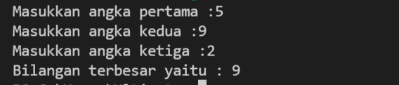

 # Latihan membuat conditional dan loop python   

* Nama          : Hizbullah Ridwan
* NIM           : 312110055
* Kelas         : TI.21.C.1
* Mata Kuliah   : Bahasa Pemrograman
----------------------------------
Dalam latihan membuat conditional dan loop [python](https://www.python.org/) ini, saya menggunakan [visual studio code](https://code.visualstudio.com/) sebagai teks editornya.     

1. **Conditional**     
   * [Membuat program menentukan nilai akhir](https://github.com/Ridwanwildan/Conditional-Loop-Python#membuat-program-menentukan-nilai-akhir)         
   * [Membuat program menampilkan status gaji karyawan](https://github.com/Ridwanwildan/Conditional-Loop-Python#membuat-program-menampilkan-status-gaji-karyawan)    
   * [Penggunaan kondisi OR](https://github.com/Ridwanwildan/Conditional-Loop-Python#penggunaan-kondisi-or)      
   * [Tugas praktikum 2](https://github.com/Ridwanwildan/Conditional-Loop-Python#tugas-praktikum-2)      
   * [Tugas 1: Menentukan dua bilangan terbesar](https://github.com/Ridwanwildan/Conditional-Loop-Python#tugas-1-menentukan-dua-bilangan-terbesar)      
   * [Tugas 2: Mengurutkan data dari data terkecil](https://github.com/Ridwanwildan/Conditional-Loop-Python#tugas-2-mengurutkan-tiga-data-dari-data-terkecil)       

2. **Loop**
   * [Tugas 1: Menampilkan n bilangan acak yang lebih kecil dari 0.5](https://github.com/Ridwanwildan/Conditional-Loop-Python#tugas-1-menampilkan-n-bilangan-acak-yang-lebih-kecil-dari-05)       
   * [Tugas 2: Menampilkan bilangan terbesar dari n data yang diinput](https://github.com/Ridwanwildan/Conditional-Loop-Python#tugas-2-menampilkan-bilangan-terbesar-dari-n-data-yang-diinput)    
   * [Tugas 3: Menghitung laba](https://github.com/Ridwanwildan/Conditional-Loop-Python#tugas-3-menghitung-laba)      
   * [Tugas 4: Program nested](https://github.com/Ridwanwildan/Conditional-Loop-Python#tugas-4-program-nested)        
  
## Membuat program menentukan nilai akhir    

```bash
nama = input("Masukkan nama:")
uts = input("Masukkan nilai UTS:")
uas = input("Masukkan nilai UAS:")
tugas = input("Masukkan nilai Tugas:")

akhir = (int(tugas) * .2) + (int(uts) * .4) + (int(uas) * .4)
keterangan = ("TIDAK LULUS", "LULUS")[akhir > 60.0]
if akhir > 80:
 huruf = "A"
elif akhir > 70:
 huruf = "B"
elif akhir > 50:
 huruf = "C"
elif akhir > 40:
 huruf = "D"
else:
 huruf = "E"
print("Nama :",nama)
print("Nilai UTS :",uts)
print("Nilai UAS :",uas)
print("Nilai Tugas :",tugas)
print("Nilai Akhir :",akhir)
print("Nilai Huruf :",huruf)
print("Keterangan :",keterangan)
```    

Dalam program menentukan nilai akhir ini, menggunakan conditional if yang nantinya akan menentukan huruf apa yang akan ditampilkan. Huruf yang ditampilkan akan sesuai dengan rumusnya. Dan jika kita lihat outputnya maka akan seperti ini :      

      

## Membuat program menampilkan status gaji karyawan     

```bash
gaji = int(input("Masukkan gaji:"))
berkeluarga = (False, True)[input("Sudah berkeluarga? (Y/T)") == "Y"]
punya_rumah = (False, True)[input("Punya rumah? (Y/T)") == "Y"]

if gaji > 3000000:
     print ("Gaji sudah diatas UMR")
     if berkeluarga:
          print ("Waji ikutan asuransi dan menabung untuk pensiun")
     else:
          print("Tidak perlu asuransi")
     if punya_rumah:
          print ("wajib bayar pajak rumah")
     else:
          print("tidak wajib bayar pajak rumah")

else:
     print("Gaji belum UMR")
```       

Dalam program ini, masih sama yaitu menggunakan conditional if yang nantinya akan menampilkan output sesuai dengan apa yang diinputkan. Pada bagian input terdapat boolean true false yang menentukan nilai tersebut. Dan jika kita lihat outputnya maka akan seperti ini :      

      

## Penggunaan kondisi OR

```bash
a = int(input("Masukkan bilangan A: "))
b = int(input("Masukkan bilangan B: "))
c = int(input("Masukkan bilangan C: "))
if a+b == c or b+c == a or c+a == b:
 print("BENAR")
else:
 print("SALAH")
```       

Dalam program ini, masih menggunakan conditional if untuk menentukan outputnya. Selain itu ditentukan juga oleh kondisi OR. Kondisi OR ini artinya jika kondisi dari salah satu statement ada yang bernilai true, maka dia akan menampilkan output true (output yang diinginkan). Jika tidak ada sama sekali maka bernilai false. Outputnya seperti ini :       

       

## Tugas praktikum 2     

> Buat program sederhana dengan input tiga buah bilangan, dari ketiga bilangan tersebut tampilkan bilangan terbesarnya. Gunakan statement if.      

```bash
a = int(input("Masukkan angka pertama :"))
b = int(input("Masukkan angka kedua :"))
c = int(input("Masukkan angka ketiga :"))

if a >= b >= c or a >= c >= b:
     print("Bilangan terbesar yaitu :",a)
if b >= a >= c or b >= c >= a:
     print("Bilangan terbesar yaitu :",b)
if c >= a >= b or c >= b >= a:
     print("Bilangan terbesar yaitu :",c)
```       

         

Terdapat 3 inputan integer yaitu **a**, **b**, dan **c**. Outputnya nanti akan menghasilkan satu nilai terbesar antara **a**, **b**, dan **c**. Output itu ditentukan oleh conditional if dan kondisi OR. untuk membandingkan mana nilai yang terbesar digunakan tanda >= (besar sama dengan). Outputnya seperti ini :     

       

## Tugas 1: Menentukan dua bilangan terbesar       

```bash
a = int(input("Masukkan angka pertama :"))
b = int(input("Masukkan angka kedua :"))

if a > b:
     print("Bilangan terbesar yaitu :",a)
if b > a:
     print("Bilangan terbesar yaitu :",b)
```        

Ada dua input integer. Jika nilai **A** lebih besar dari **B**, maka nilai **A** yang akan ditampilkan, sedangkan Jika nilai **B** lebih besar dari **A**, maka nilai **B** yang akan ditampilkan. Outputnya adalah ini :       

       

## Tugas 2: Mengurutkan tiga data dari data terkecil       

```bash
a = int(input("Masukkan angka pertama :"))
b = int(input("Masukkan angka kedua :"))
c = int(input("Masukkan angka ketiga :"))

print("Program mengurutkan data")
print("Bilangan ke-1 :", a)
print("Bilangan ke-2 :", b)
print("Bilangan ke-3 :", c)

if a <= b <= c :
     print("Urutan bilangan :",a, b, c)
elif a <= c <= b :
     print("Urutan bilangan :",a, c, b)
elif b <= a <= c :
     print("Urutan bilangan :",b, a, c)
elif b <= c <= a :
     print("Urutan bilangan :",b, c, a)
elif c <= a <= b :
     print("Urutan bilangan :",c, a, b)
else :
     print("Urutan bilangan :",c, b, a)
```      

Dari input 3 data ini, kita bebas mengisi angka berapa saja yang nantinya angka tersebut akan tersusun dari yang paling terkecil sampai yang paling terbesar. Contohnya seperti ini :       

       

## Tugas 1: Menampilkan n bilangan acak yang lebih kecil dari 0.5             

```bash
from random import random
import random

jumlah = int(input("Masukkan nilai N :"))
for i in range(jumlah):
 a = random.uniform(0.0, 0.5)
 print(f"Data ke-{i+1}", a)
print("Selesai")
```      

Pada program ini, saya menggunakan for loop yang looping nya bisa dibatasi sebanyak **n** kali. Kita bisa bebas menentukan berapa kali variable **i** akan loop. Saat menampilkan output karena nilai **i** dimulai dari angka 0, maka saya menambahkan **{i+1}** supaya **i** mulai menghitung looping dari angka 1. Ada juga function **random.uniform()** untuk menampilkan bilangan acak mulai dari 0.0 sampai 0.5. Contohnya seperti ini:      

    

## Tugas 2: Menampilkan bilangan terbesar dari n data yang diinput     

```bash
a=0
while True:
    b=int(input("Masukkan bilangan :"))
    if a < b :
        a = b
    elif b==0:
        break
print("Bilangan terbesar adalah :",a)
```        

Pada program ini, kita bebas mengisi nilai yang kita isi dan bebas mau sampai berapa kali. Jika kita ingin mengakhirinya, kita bisa memasukkan angka **0** dan pada saat itu juga bisa dilihat angka berapa yang paling besar yang sudah kita masukkan tadi. Contohnya seperti ini:      

       

## Tugas 3: Menghitung laba         

> Seorang pengusaha menginvestasikan uangnya untuk memulai usahanya dengan modal awal 100 juta, pada bulan pertama dan kedua belum mendapatkan laba. pada bulan ketiga baru mulai mendapatkan laba sebesar 1% dan pada bulan ke 5, pendapatan meningkat 5%, selanjutnya pada bulan ke 8 mengalami penurunan keuntungan sebesar 2%, sehingga laba menjadi 3%. Hitung total keuntungan selama 8 bulan berjalan usahanya.           

```bash
modal = 100000000
for i in range(9):
 i = i+1
 if (i>=1 and i<=2):
     print(f"Laba bulan ke-{i} sebesar :",modal*0)
 elif (i>=3 and i<=4):
     print(f"Laba bulan ke-{i} sebesar :",modal*0.1)
 elif (i>=5 and i<=7):
     print(f"Laba bulan ke-{i} sebesar :",modal*0.5)
 elif (i==8):
     print(f"Laba bulan ke-{i} sebesar :",modal*0.2)
total = (((modal*0)*2) + ((modal*0.1)*2) + ((modal*0.5)*3) + ((modal*0.2)*1))
print("Total laba adalah :", total)
```         

Pada program ini, menggunakan perulangan for dan juga conditional if untuk menentukan outputnya. Untuk menghitung persentase nya menggunakan angka desimal seperti **0.1** untuk **1%**. Kemudian semua laba nya dihitung dan dimasukkan kedalam variable. Contohnya seperti ini :         

       

## Tugas 4: program nested               

```bash
x = 10
y = 10

for i in range(x):
 for j in range(y):
     tambah = i+j
     print("{0:>3}".format(tambah), end="")
 print()
```       

Output ini akan menghasilkan angka berurutan secara vertikal dan horizontal menggunakan perulangan for yang didalamnya ada perulangan for lagi (nested). Kemudian diberi **format()** supaya angka yang vertikal dan horizontal dapat bertambah dan berurutan. Hasilnya seperti ini :           

       

